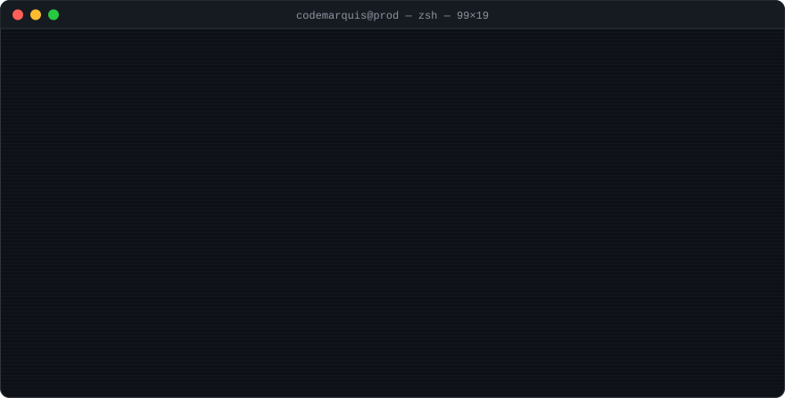
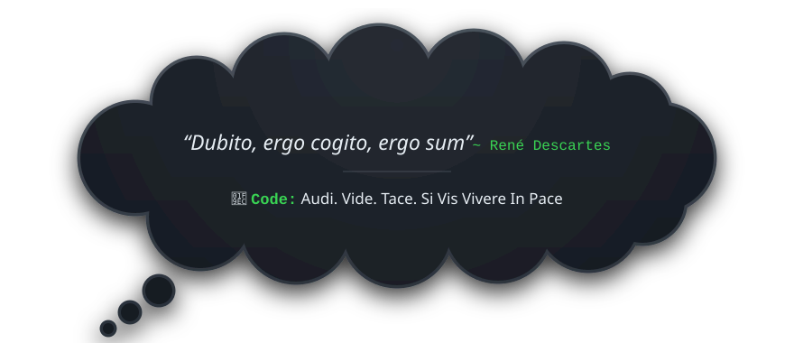

 

**Cloud & DevOps Engineer** — I automate infrastructure, build secure delivery pipelines, and keep production boring.

 
Looking for <b>Cloud</b>, <b>DevOps</b> &amp; <b>DevSecOps</b> roles

---

### `$ cat stack.yaml`

<table>
<tr><td><b>cloud</b></td><td>

</td></tr>
<tr><td><b>iac &amp; gitops</b></td><td>

</td></tr>
<tr><td><b>containers</b></td><td>

</td></tr>
<tr><td><b>ci / cd</b></td><td>

</td></tr>
<tr><td><b>devsecops</b></td><td>

</td></tr>
<tr><td><b>cloud security</b></td><td>

</td></tr>
<tr><td><b>observability</b></td><td>

</td></tr>
<tr><td><b>languages</b></td><td>

</td></tr>
<tr><td><b>web</b></td><td>

</td></tr>
<tr><td><b>data</b></td><td>

</td></tr>
</table>

### `$ ls ~/projects --featured`

**[freipark](https://github.com/codemarquis/freipark)** — free & paid street-parking finder for Berlin. Expo + MapLibre on the front, FastAPI + PostGIS on the back, self-hosted Supabase behind Caddy, map tiles served from Cloudflare R2 with zero per-request cost, Sentry + PostHog for observability.

### `$ git log --stats`

### `$ cat motto.txt`

### `$ ping codemarquis`

      

Support my work 
   

<!-- Terminal: edit SCRIPT in scripts/build-terminal.mjs, run `node scripts/build-terminal.mjs`. Motto: edit scripts/build-motto.mjs, run `node scripts/build-motto.mjs`. -->
